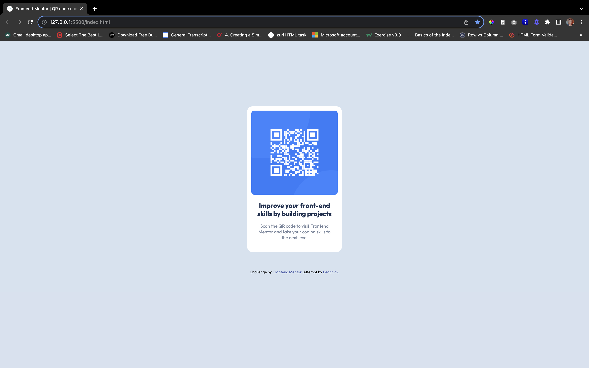

# Frontend Mentor - QR code component solution

This is a solution to the [QR code component challenge on Frontend Mentor](https://www.frontendmentor.io/challenges/qr-code-component-iux_sIO_H). Frontend Mentor challenges help you improve your coding skills by building realistic projects. 

## Table of contents

  - [Overview](#overview)
  - [Screenshot](#screenshot)
  - [Links](#links)
  - [Built with](#built-with)
  - [Author](#author)

## Overview

This is my personal take on creating the QR code component based on designs provided by frontend mentor

### Screenshot

### Links

- Solution URL: [Add solution URL here](https://github.com/peachypeaches/qr-code-component-main)
- Live Site URL: [Add live site URL here](https://peachypeaches.github.io/qr-code-component-main/)

### Built with

- Semantic HTML5 markup
- CSS custom properties
- Flexbox

## Author

- Website - [Peachick](https://github.com/peachypeaches)
- Frontend Mentor - [@peachypeaches](https://www.frontendmentor.io/profile/peachypeaches)
- Twitter - [@yourusername](https://www.twitter.com/yourusername)

